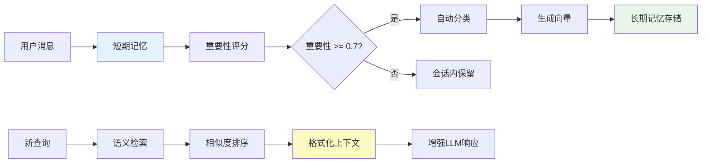

# 记忆系统架构指南

## 概述

记忆系统为Agent提供了**短期记忆**和**长期记忆**的协同工作机制，使Agent能够：

- 🧠 **记住重要信息**：自动识别并保存高重要性的对话内容
- 🔍 **语义检索**：基于向量相似度的智能记忆检索
- 📝 **跨会话持久化**：重要的用户偏好和任务上下文可跨会话复用
- 🎯 **上下文增强**：将记忆与RAG知识库整合，提供更准确的响应

## 架构设计

### 核心组件

```
┌─────────────────────────────────────────────────────────────┐
│                        AgentEngine                          │
│  ┌──────────────────────────────────────────────────────┐  │
│  │              MemoryOrchestrator                       │  │
│  │  ┌─────────────────┐      ┌─────────────────┐        │  │
│  │  │ ShortTerm       │      │ LongTerm        │        │  │
│  │  │ MemoryManager   │◄────►│ MemoryStore     │        │  │
│  │  │                 │      │                 │        │  │
│  │  │ - Importance    │      │ - ChromaDB      │        │  │
│  │  │   Scorer        │      │ - Vector Search │        │  │
│  │  │ - Summarizer    │      │ - Classifier    │        │  │
│  │  └─────────────────┘      └─────────────────┘        │  │
│  └──────────────────────────────────────────────────────┘  │
└─────────────────────────────────────────────────────────────┘
```

### 数据流



## 短期记忆 (Short-Term Memory)

### 功能特性

1. **自动重要性评分**
   - 基于启发式规则评估消息价值
   - 考虑角色、内容长度、关键词等因素
   - 分数范围：0.0-1.0

2. **智能压缩**
   - 当消息超过100条时触发压缩
   - 将低重要性消息合并为摘要
   - 保留高重要性消息的完整性

### 关键代码

```python
# agent/memory/short_term/importance_scorer.py

class ImportanceScorer:
    async def score(self, content: str, role: str) -> float:
        score = 0.5  # 基础分

        # 角色权重
        if role == "user":
            score += 0.2

        # 关键词匹配
        if "?" in content:  # 问题类
            score += 0.15
        if "我喜欢" in content:  # 偏好类
            score += 0.15
        if "```" in content:  # 代码类
            score += 0.2

        return max(0.0, min(1.0, score))
```

### 数据结构

```python
@dataclass
class ConversationMemory:
    message_id: str
    role: str              # user/assistant/system
    content: str
    importance_score: float  # 0.0-1.0
    timestamp: datetime
    is_summary: bool        # 是否为摘要
    summary_of: list[str]   # 如果是摘要，原始消息IDs
```

## 长期记忆 (Long-Term Memory)

### 功能特性

1. **向量存储**
   - 复用ChromaDB向量数据库
   - 使用Ollama nomic-embed-text模型
   - 支持元数据过滤

2. **语义检索**
   - 基于余弦相似度的向量搜索
   - 自动排序并返回Top-K结果
   - 包含相关性分数

3. **自动分类**
   - USER_PREFERENCE: 用户偏好
   - TASK_CONTEXT: 任务上下文
   - KNOWLEDGE: 知识积累
   - CONVERSATION: 普通对话

### 关键代码

```python
# agent/memory/long_term/memory_store.py

class LongTermMemoryStore:
    async def add_memory(self, memory: Memory) -> None:
        # 生成嵌入
        memory.embedding = await self.embedder.embed(
            memory.content
        )

        # 转换为Document格式
        doc = Document(
            id=memory.id,
            content=memory.content,
            metadata={
                "memory_type": memory.memory_type.value,
                "importance": memory.importance.value,
                "timestamp": memory.timestamp.isoformat(),
            },
            embedding=memory.embedding,
        )

        # 存储到ChromaDB
        await self.vector_store.add_documents([doc])

    async def search_memories(
        self, query: str, top_k: int = 5
    ) -> List[Tuple[Memory, float]]:
        # 向量搜索
        results = await self.vector_store.search(
            query=query,
            top_k=top_k,
        )

        # 转换为Memory对象
        return [
            (Memory.from_doc(r.document), r.score)
            for r in results
        ]
```

### 记忆分类

```python
# agent/memory/long_term/memory_classifier.py

class MemoryClassifier:
    def classify(self, content: str, role: str) -> MemoryType:
        if role == "user":
            # 用户偏好模式
            if re.search(r"i (prefer|like|want)", content, re.I):
                return MemoryType.USER_PREFERENCE

            # 任务上下文模式
            if re.search(r"(working on|task)", content, re.I):
                return MemoryType.TASK_CONTEXT

        return MemoryType.CONVERSATION
```

## 协同工作流程

### 1. 用户消息处理

```python
# agent/core/agent_engine.py

async def process_message(self, user_message: str) -> str:
    # 步骤1: 添加到短期记忆
    await self._memory_orchestrator.add_conversation_message(
        message_id=str(uuid.uuid4()),
        role="user",
        content=user_message,
    )

    # 步骤2: 检索相关长期记忆
    memory_result = await self._memory_orchestrator.retrieve_relevant_memories(
        query=user_message,
        top_k=5,
    )

    # 步骤3: 整合上下文
    contexts = []
    if memory_result.memories:
        contexts.append(
            self._memory_orchestrator.format_memories_for_llm(memory_result)
        )
    if rag_context:
        contexts.append(rag_context)

    enhanced_message = "\n\n".join(contexts) + f"\n\nUser: {user_message}"

    # 步骤4: 生成响应
    response = await self._process_with_tools(max_iterations, user_message)

    # 步骤5: 添加助手响应到短期记忆
    await self._memory_orchestrator.add_conversation_message(
        message_id=str(uuid.uuid4()),
        role="assistant",
        content=response,
    )

    # 步骤6: 自动保存重要记忆
    if self.config.memory.auto_save_to_long_term:
        saved_count = await self._memory_orchestrator.save_important_memories()

    return response
```

### 2. 上下文整合

记忆上下文格式示例：

```
## Relevant Memories

### Memory 1 (Relevance: 82%)
Type: user_preference
我叫Alice，是一名Python开发者

### Memory 2 (Relevance: 75%)
Type: user_preference
我通常使用Jupyter Notebook进行开发

### Memory 3 (Relevance: 68%)
Type: task_context
正在开发数据分析项目
```

### 3. 自动保存触发条件

```python
# 筛选条件
memories_to_save = [
    m for m in short_term.memories
    if m.importance_score >= 0.7      # 重要性阈值
    and not m.is_summary               # 非摘要
    and m.role in ["user", "assistant"]  # 用户或助手消息
]
```

## 配置参数

### 配置文件 (agent/config.yaml)

```yaml
memory:
  # 短期记忆配置
  short_term_max_messages: 100
  short_term_summary_threshold: 80
  short_term_importance_threshold: 0.6

  # 长期记忆配置
  long_term_enabled: true
  long_term_vector_db_path: "./data/memory_chroma"
  long_term_collection_name: "long_term_memory"
  long_term_embedder_model: "nomic-embed-text"
  long_term_embedder_base_url: "http://localhost:11434"

  # 自动保存配置
  auto_save_to_long_term: true
  auto_save_importance_threshold: 0.7

  # 检索配置
  retrieval_top_k: 5
  retrieval_min_score: 0.5
```

### 参数说明

| 参数 | 说明 | 默认值 |
|------|------|--------|
| `short_term_max_messages` | 短期记忆最大消息数 | 100 |
| `auto_save_importance_threshold` | 自动保存的重要性阈值 | 0.7 |
| `retrieval_top_k` | 检索返回的记忆数量 | 5 |
| `long_term_vector_db_path` | 长期记忆存储路径 | ./data/memory_chroma |

## 使用示例

### 1. 自动模式（默认）

```bash
# 启动Agent，记忆系统自动工作
python -m agent.cli.main

# 对话示例
> 我叫Alice，喜欢Python编程
# 自动保存到长期记忆

> 我的名字是什么？
# 从记忆中检索并回答：你的名字是Alice
```

### 2. 手动API

```python
# 创建手动记忆
await agent.create_memory(
    content="用户偏好使用暗色主题的IDE",
    memory_type="user_preference",
    importance="important"
)

# 搜索记忆
memories = await agent.search_memories(
    query="IDE主题",
    top_k=3
)

# 查看统计
stats = agent.get_memory_stats()
print(stats)
# {
#   "short_term": {"total_memories": 50},
#   "long_term": {"count": 25, "name": "long_term_memory"}
# }
```

### 3. 程序化使用

```python
from agent.memory.integration.memory_orchestrator import MemoryOrchestrator
from agent.memory.types import MemoryType

# 初始化
orchestrator = MemoryOrchestrator(
    long_term_vector_db_path="./data/memory_chroma"
)
await orchestrator.initialize()

# 添加对话
await orchestrator.add_conversation_message(
    message_id="msg1",
    role="user",
    content="我正在学习机器学习"
)

# 检索相关记忆
result = await orchestrator.retrieve_relevant_memories(
    query="学习主题",
    top_k=5
)

# 手动创建记忆
memory = await orchestrator.create_manual_memory(
    content="用户对深度学习感兴趣",
    memory_type=MemoryType.USER_PREFERENCE,
    importance="important"
)
```

## 性能优化

### 1. 嵌入缓存

```python
# 复用RAG的嵌入缓存
self.embedder = OllamaEmbedder(
    model="nomic-embed-text",
    cache_path="./data/embeddings_cache",
    enable_cache=True,
)
```

### 2. 向量索引

ChromaDB使用HNSW算法进行高效近似最近邻搜索：
- 索引构建时间：O(n log n)
- 查询时间：O(log n)
- 空间复杂度：O(n)

### 3. 批量操作

```python
# 批量保存记忆
await self.long_term.add_memories(memories_list)
```

## 监控与调试

### 查看记忆统计

```python
stats = agent.get_memory_stats()
print(f"短期记忆: {stats['short_term']['total_memories']}条")
print(f"长期记忆: {stats['long_term']['count']}条")
```

### 检索记忆

```python
memories = await agent.search_memories("Python", top_k=5)
for memory_dict in memories:
    print(f"[{memory_dict['memory_type']}] {memory_dict['content']}")
```

### 清空记忆

```python
# 清空短期记忆
await agent.clear_conversation()

# 清空所有长期记忆（危险操作）
agent._memory_orchestrator.clear_all_memories()
```

## 最佳实践

### 1. 调整重要性阈值

根据应用场景调整阈值：
- **对话式应用**：0.6-0.7（保留更多上下文）
- **任务式应用**：0.7-0.8（只保留关键信息）
- **知识库应用**：0.8-0.9（只保存高价值内容）

### 2. 检索数量

根据Token预算调整：
- **小模型**（<4K tokens）：top_k=3
- **中模型**（4K-8K tokens）：top_k=5
- **大模型**（>8K tokens）：top_k=10

### 3. 记忆分类

自定义分类规则以适应应用：

```python
class CustomMemoryClassifier(MemoryClassifier):
    def classify(self, content: str, role: str) -> MemoryType:
        # 添加自定义模式
        if re.search(r"API|接口", content):
            return MemoryType.TECHNICAL

        return super().classify(content, role)
```

## 流程图

- **流程图**: `docs/13_memory_flow_diagram.puml`
- **序列图**: `docs/14_memory_sequence_diagram.puml`

生成图片：

```bash
# 使用PlantUML生成PNG
plantuml docs/13_memory_flow_diagram.puml
plantuml docs/14_memory_sequence_diagram.puml
```

## 故障排除

### 问题1：记忆未被保存

**检查**：
```python
# 确认记忆系统已启用
print(agent._memory_enabled)  # 应该为True

# 检查配置
print(config.memory.auto_save_to_long_term)  # 应该为True
print(config.memory.auto_save_importance_threshold)  # 检查阈值
```

### 问题2：检索不到相关记忆

**检查**：
```python
# 确认有记忆被保存
stats = agent.get_memory_stats()
print(stats['long_term']['count'])  # 应该 > 0

# 尝试降低阈值
config.memory.retrieval_min_score = 0.3
```

### 问题3：向量存储错误

**解决**：
```bash
# 清空并重建向量存储
rm -rf ./data/memory_chroma
python -c "
import asyncio
from agent.memory.integration.memory_orchestrator import MemoryOrchestrator

async def rebuild():
    orch = MemoryOrchestrator()
    await orch.initialize()
    print('Vector store rebuilt')

asyncio.run(rebuild())
"
```

## 总结

记忆系统通过短期记忆和长期记忆的协同工作，为Agent提供了强大的上下文管理能力：

- ✅ 自动识别和保存重要信息
- ✅ 基于语义的智能检索
- ✅ 跨会话的记忆持久化
- ✅ 与RAG系统的无缝集成
- ✅ 灵活的配置和扩展

通过合理配置和使用，记忆系统可以显著提升Agent的智能水平和用户体验。
